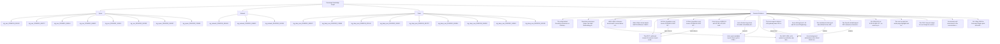

# Sovereign Audit Ledger

## Current Knowledge Graph Status

```mermaid
graph TD
  ROOT[Sovereign Knowledge Graph] --> Space
  ROOT --> Network
  ROOT --> Trade
  ROOT --> Forensic[Forensic Evidence]
  Forensic --> NODE_entity_001["The entity behind Resolution Assurance is Christop..."]
  Forensic --> NODE_framework_001["Resolution Assurance Waste Tax Audit Methodology â..."]
  Forensic --> NODE_rule_productivity["Per HWI-X §3, an AI system is productive only whe..."]
  Forensic --> NODE_benchmark_cost["HWI-X §5.2 reference benchmarks: human labour rat..."]
  Forensic --> NODE_churn_bands["HWI-X §5.3 churn bands: 0–20% Efficient; 21–4..."]
  Forensic --> NODE_accc_anchor["The ACCC confirmed receipt of consumer report numb..."]
  Forensic --> NODE_aidrive_refund_1["AI Drive (myaidrive.com) invoice 21H9HLEU-0002 —..."]
  Forensic --> NODE_aidrive_refund_2["AI Drive (myaidrive.com) invoice 21H9HLEU-0003 —..."]
  Forensic --> NODE_accio_billing["Accio top-up of A$50.53 with 20,145 of 25,050 cred..."]
  Forensic --> NODE_accio_bg_pulses["Accio Sentinel logs show 39 visible scheduled puls..."]
  Forensic --> NODE_accio_cycle_contradiction["Accio cycle metadata reports 'Next cycle in 2792s'..."]
  Forensic --> NODE_accio_alibaba_route["Accio background automation routes Gmail OAuth via..."]
  Forensic --> NODE_accio_llm_gateway["The Accio agent runtime's LLM gateway base URL is ..."]
  Forensic --> NODE_accio_bypass["Accio sdk.log lines 8, 14 and 20 record 'Bypassing..."]
  Forensic --> NODE_base44_admission["The raw Base44 chat log at base44chat.txt line 465..."]
  Forensic --> NODE_openai_scorecard["The OpenAI refund/support PDF embeds an interactio..."]
  Forensic --> NODE_microsoft_bounce["On 2026-05-03 at 02:51:00.852 UTC, an email to pri..."]
  Forensic --> NODE_chatgpt_ui_change["The user records that whole-page highlight-and-scr..."]
  Forensic --> NODE_tccc_ledger["The TCCC forensic ledger for one RelayLife session..."]
  Forensic --> NODE_self_assessment["An assistant self-assessment in the conversation e..."]
  Forensic --> NODE_pack_built["On 4 May 2026 the Sovereign Engine pack was built:..."]
  NODE_aidrive_refund_1 -- "same-day-as" --> NODE_accc_anchor
  NODE_aidrive_refund_2 -- "same-day-as" --> NODE_accc_anchor
  NODE_accio_bg_pulses -- "supports" --> NODE_accio_cycle_contradiction
  NODE_accio_llm_gateway -- "shares-host" --> NODE_accio_alibaba_route
  NODE_base44_admission -- "violates" --> NODE_rule_productivity
  NODE_openai_scorecard -- "violates" --> NODE_rule_productivity
  Trade --> sig_deep_sea_20260512_060507
  Trade --> sig_deep_sea_20260512_135645
  Trade --> sig_deep_sea_20260513_021244
  Trade --> sig_deep_sea_20260513_063410
  Trade --> sig_deep_sea_20260513_063757
  Trade --> sig_deep_sea_20260513_064044
  Trade --> sig_deep_sea_20260513_064824
  Trade --> sig_deep_sea_20260513_163413
  Trade --> sig_deep_sea_20260513_180155
  Space --> sig_neo_20260513_063410
  Space --> sig_neo_20260513_063757
  Space --> sig_neo_20260513_064044
  Space --> sig_neo_20260513_064823
  Space --> sig_neo_20260513_163413
  Space --> sig_neo_20260513_180152
  Network --> sig_network_20260513_064044
  Network --> sig_network_20260513_064823
  Network --> sig_network_20260513_180151
  Space --> sig_space_20260512_060507
  Space --> sig_space_20260512_135645
```
